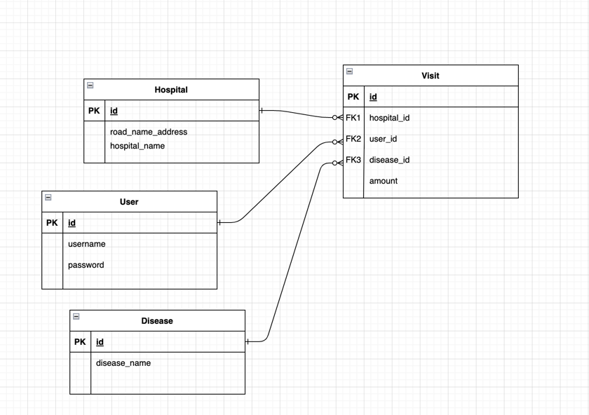

# Spring Security & JWT 실습

## ❄️ 공식 문서

📗 Spring Security : https://docs.spring.io/spring-authorization-server/docs/current/reference/html/getting-started.html

📗 JWT : https://jwt.io/

## 다이어그램

## 구현기능

| 기능               |                  api                  |                                                Ex                                                |
|------------------|:-------------------------------------:|:------------------------------------------------------------------------------------------------:|
| 회원가입             |     Post  /api/v1/users/join      |  |
| Exception 처리     |                                       |  |
| 로그인              |     Post  /api1/v1/users/login     |  |
| 로그인 토큰처리         |                                       |  |
| JWT로 접근 권한 설정하기  |                                       |  |
| 방문기능             |            /api/v1/visists            |  |
| 방문 전체 조회         |        Get   /api/v1/visits        |  |
| 특정 user의 방문기록 조회 |   Get  /api/v1/visits/users/{id}   |  |
| 특정 병원의 방문기록 조회   | Get  /api/v1/visits/hospitals/{id} |  |

